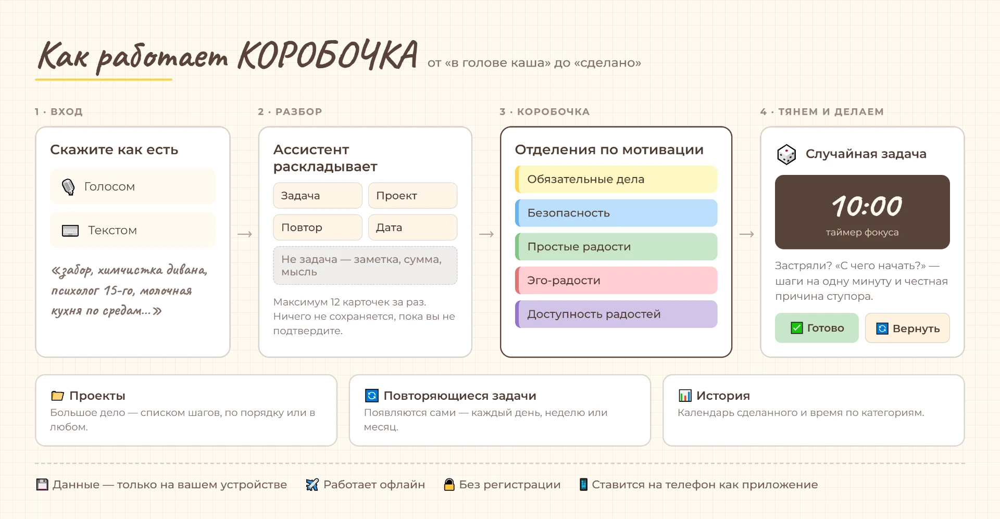

# 🎁 КОРОБОЧКА

**Планировщик для тех, у кого «надо» не превращается в «сделано».**
Ссыпьте дела в коробочку, вытяните одно наугад, включите таймер. Всё — на вашем телефоне, без регистрации и без интернета.

### [→ Открыть КОРОБОЧКУ](https://korobo4ka.lovable.app)

[Зачем это](#-зачем-это-нужно) · [Как работает](#-как-работает) · [Категории](#-шесть-отделений) · [Что умеет](#-что-умеет) · [Установка](#-установить-на-телефон) · [Приватность](#-приватность) · [Вопросы](#-частые-вопросы)

---

## 🎯 Зачем это нужно

Списки дел устроены нечестно: наверху висит самое неприятное, и поэтому не двигается ничего. КОРОБОЧКА убирает выбор — вы не решаете, за что взяться, вы вытягиваете бумажку.

> **«Надо позвонить в поликлинику»** — висит третью неделю. Попадает в «Обязательные», выпадает случайно во вторник, десять минут по таймеру, звонок сделан.

> **«Хочу наконец почитать»** — то, что всегда откладывается на «когда всё остальное». Лежит в «Простых радостях» наравне с делами и точно так же выпадает.

> **«В голове каша»** — надиктуйте всё как есть, ассистент «Разбор» разложит на задачи, проекты и заметки. Вы только подтверждаете.

Что даёт такой подход:

- **🛡️ Шанс скучным делам.** Рутины, профилактика, «несрочное но важное» перестают проигрывать вечной борьбе за первое место.
- **🎯 Место для радостей.** Простые и эго-радости лежат в коробочке как полноценные дела — и выпадают так же часто.
- **⏱️ Защита от двух крайностей.** Таймер помогает и начать, и вовремя остановиться, чтобы не увязнуть на весь день.
- **💡 Честная диагностика.** Если вытянутая бумажка вызывает протест — это ценная информация о себе, а не провал.

Это «лайтовая» самодисциплина: содержание определяете вы, паузу можно сделать в любой момент.

---

## 🔄 Как работает

Коротко, в пять шагов:

1. **Насыпьте дел** — по одному, списком или голосом. Не сортируя.
2. **Разложите по отделениям** — как бумажки по секциям коробки. Или доверьте это «Разбору».
3. **Вытяните 🎲** — приложение выберет случайную задачу из отделения.
4. **Поработайте по таймеру** — время настраивается, по умолчанию 10 минут.
5. **Отметьте результат** — ✅ **Готово** или 🔄 **Вернуть в коробочку**. Второе — нормально.

Застряли посреди задачи? Кнопка **«С чего начать?»** предложит записать шаг на одну минуту и спросит, что именно мешает: скучно, непонятно, страшно, нет сил. У каждой причины — своя подсказка.

---

## 🗂️ Шесть отделений

Категории — из методики мотивационной гигиены психолога Виолетты Макеевой. Дело попадает в отделение не по срочности, а по тому, откуда берётся мотивация.

| | Отделение | Что туда кладут |
|---|---|---|
| 🟨 | **Обязательные** | Срочное и важное: работа, дом, здоровье, финансы, учёба |
| 🟦 | **Безопасность** | Базовые потребности: подушка на всякий случай, документы, навыки |
| 🟩 | **Простые радости** | Приятные мелочи: природа, творчество, чтение, музыка, готовка |
| 🟥 | **Эго-радости** | Дела ради статуса и признания: карьера, достижения, образование |
| 🟪 | **Доступность радостей** | Условия, без которых радости не случаются: время, деньги, энергия, место |
| ⚪ | **Без категории** | Всё, что пока не разобрано |

Последнее отделение — самое интересное. Эго-радости обслуживают чужие ожидания чаще, чем нам кажется; когда они лежат отдельно, видно, какие из них действительно ваши.

Названия отделений и подкатегорий можно переименовать под себя.

---

## ⚡ Что умеет

<b>Основное</b>

- **🎲 Случайный выбор** — вытягивание бумажки вслепую, из любого отделения.
- **⏱️ Таймер фокуса** — настраиваемая длительность, фоновая картинка под цвет категории, накопительный учёт потраченного времени.
- **✨ Разбор** — надиктуйте или вставьте поток мыслей, ассистент вернёт черновик: задачи, проекты, повторяющиеся дела, события с датой. Отдельно — «не задача»: суммы, заметки, размышления. Максимум 12 карточек за раз, ничего не сохраняется без вашего подтверждения.
- **📁 Проекты** — большое дело списком шагов, по порядку или в любом. С библиотекой готовых чек-листов: уборка, звонки, документы, готовка, ремонт, сад.
- **🔄 Повторяющиеся задачи** — ежедневные, по будням, по выбранным дням недели, ежемесячные, с датой окончания. Появляются сами, в заданный час.
- **📊 История и статистика** — календарь выполненного, время по категориям, топ задач по затраченному времени.

<b>Мелочи, которые важны каждый день</b>

- **🎙️ Голосовой ввод** с индикатором записи — в быстром добавлении и в «Разборе».
- **🏷️ Подкатегории** — предустановленные и свои, прямо в карточке задачи.
- **👁️ Скрытие задач** — чтобы дело не попадалось случайно, пока не время.
- **📅 Задачи на будущее** — с датой и временем.
- **🔔 Уведомления** через браузер.
- **🌙 Тёмная тема.**
- **🔤 Размер шрифта и скин** — «Коробочка» с рукописным шрифтом или «Строгий», если так читать легче.
- **🔑 Свой ключ ИИ** — DeepSeek, OpenRouter, OpenAI, Groq, Mistral, Google и локальные модели. Хранится только на устройстве.
- **📤 Экспорт и импорт** всех задач в JSON — резервная копия и переезд между устройствами.

---

## 📱 Установить на телефон

Ничего скачивать и настраивать не нужно — это веб-приложение, которое умеет жить на домашнем экране.

1. Откройте [КОРОБОЧКУ](https://korobo4ka.lovable.app) в браузере.
2. **iPhone:** «Поделиться» → «На экран "Домой"». **Android:** меню браузера → «Установить приложение».
3. Дальше она открывается как обычное приложение и работает без интернета.

---

## 🔒 Приватность

Здесь нет аккаунтов, потому что нет сервера, который хранил бы ваши дела.

- Все задачи лежат в браузере на вашем устройстве (IndexedDB) и никуда не отправляются.
- Приложение работает офлайн — в самолёте, в метро, на даче без связи.
- Регистрации нет, аналитики по вашим задачам нет, платить не нужно.
- Единственное исключение — ассистент «Разбор»: текст, который вы сами вставили, уходит к языковой модели, чтобы вернуться разобранным. Остальные разделы работают полностью локально.
- Резервная копия — ваш файл: экспорт в JSON, лежит где хотите.

---

## ❓ Частые вопросы

<b>Что если вытянутая задача сейчас совсем не идёт?</b>

Нажмите «Вернуть в коробочку». Она останется в отделении и выпадет снова когда-нибудь позже. Протест против собственной задачи — не поломка, а сигнал: возможно, дело сформулировано слишком крупно, или это вообще не ваше дело.

<b>Данные пропадут, если почистить браузер?</b>

Да — поэтому есть экспорт в JSON. Делайте копию перед чисткой браузера, сменой устройства или переустановкой.

<b>Как перенести задачи на другой телефон?</b>

Экспорт в JSON на старом устройстве, импорт на новом. Синхронизации между устройствами нет — это плата за отсутствие сервера.

<b>Чем «Проекты» отличаются от «Повторяющихся задач»?</b>

Проект — одно большое дело, разбитое на шаги, которое заканчивается. Повторяющаяся задача — короткое дело, которое возвращается каждый день, неделю или месяц.

<b>Это бесплатно?</b>

Да, полностью и без условий.

---

## 🆕 Что нового

<b>6.1 — Демо-режим и простые настройки помощника</b> · сентябрь 2026

- Демо-режим: разбор можно попробовать без ключа и без настроек — 50 бесплатных разборов суммарно на всех гостей.
- Встроенный помощник доступен только владельцу приложения — по коду в настройках; старые копии приложения к нему доступа не имеют.
- Настройки помощника собраны в один список: демо, свои ключи и встроенный режим выбираются в одном месте.
- Подключение ключа и код владельца спрятаны под отдельные строки.

<b>6.0 — Ассистент «Разбор» и гибкие настройки</b> · сентябрь 2026

- **Ассистент «Разбор»** — надиктуйте или вставьте поток мыслей, ассистент разложит на задачи, проекты, повторяющиеся дела и события с датами. Всё редактируется перед сохранением.
- **Подключение своего ключа ИИ** — DeepSeek, OpenRouter, OpenAI, Groq, Mistral, Google и локальные модели. Ключ хранится только на устройстве.
- **Гибкое расписание** для повторяющихся задач: выбор дней недели, интервал, дата окончания.
- **Улучшена стабильность** распознавания ответов от разных ИИ-моделей.

<b>5.1 — Проекты, подсказки и порядок в меню</b> · август 2026

- Раздел **«Проекты»** — списки дел по шагам: можно выполнять по порядку или в любом порядке.
- **Подсказки шагов:** готовые чек-листы (уборка, звонки, готовка, зарядка) и кнопка «Спросить AI», если своих идей нет.
- **Личная библиотека чек-листов:** любой набор шагов можно сохранить как шаблон и использовать снова.
- В таймере появилась кнопка **«С чего начать?»** — записывайте шаги на одну минуту и отмечайте, из-за чего застряли.
- «Шаблоны» переименованы в **«Повторяющиеся задачи»** и снабжены пояснением, чем отличаются от проектов.
- Боковая панель разгружена: 5 разделов, всё остальное — в «Настройках». В свёрнутом виде остались только иконки.
- В настройках: размер шрифта и скин «Коробочка» / «Строгий», если рукописный шрифт читать тяжело.

---

## 📖 Откуда это взялось

КОРОБОЧКА выросла из физической коробки с бумажками. Методика — мотивационная гигиена психолога **Виолетты Макеевой**; приложение появилось из желания не быть привязанной к настоящей коробке.

Это был мой первый опыт создания приложений: прототип написал DeepSeek, дальше я продолжила сама. Начиналось как прокрастинация — способ не приступать к настоящим делам. В итоге приложение помогает мне каждый день и стало любимым хобби.

**Под капотом:** React 19, TypeScript, Vite, Tailwind CSS, IndexedDB, Service Worker. Ставится как PWA.

Нашли ошибку или хотите что-то предложить — [откройте issue](../../issues). Буду рада.

---

## 📄 Лицензия

[MIT](LICENSE) — берите, меняйте, делайте свою коробочку.
